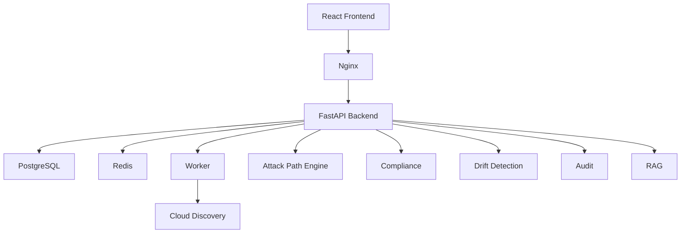

# Architecture Diagram

```mermaid
flowchart TD
    A[React Frontend] --> B[Nginx]
    B --> C[FastAPI Backend]
    C --> D[PostgreSQL]
    C --> E[Redis]
    C --> F[Worker]
    F --> G[Cloud Discovery]
    C --> H[Attack Path Engine]
    C --> I[Compliance]
    C --> J[Drift Detection]
    C --> K[Audit]
    C --> L[RAG]
```
